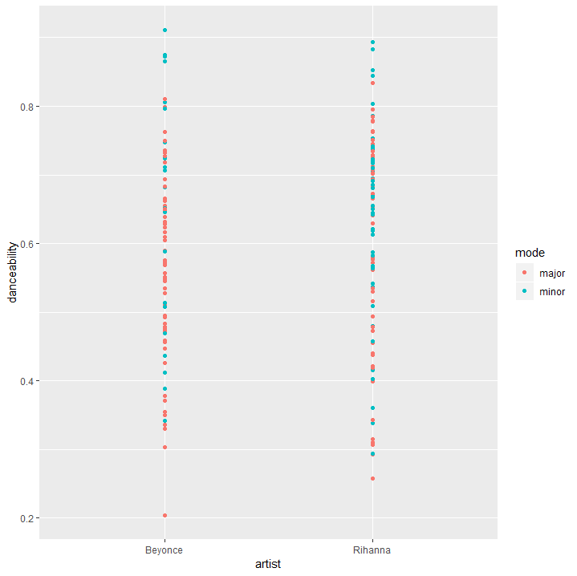
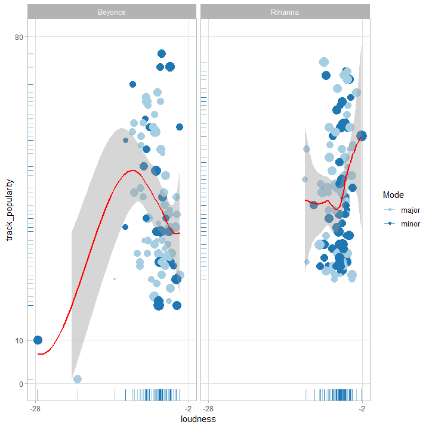
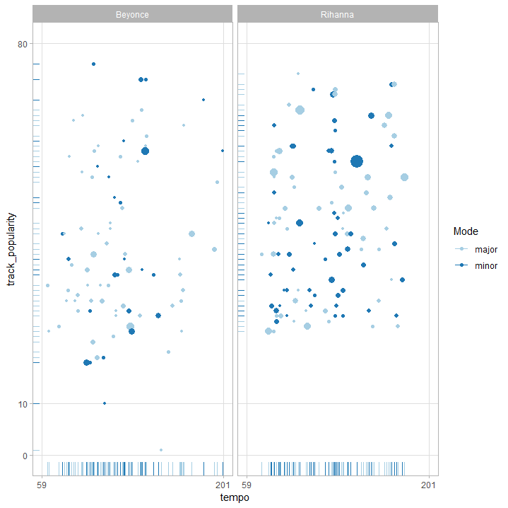

# compmus2019
Feb.10

# Research question
1. The difference between songs of Rihanna and Beyonc, the queens of pop music
2. The characterist of pop-music.

# Corpus:
The selected artists are Rihanna and Beyonce.
- Rihanna:
  - 13 albums released. Excluding the edit,remix,live versions, there are 8 official albums with 106 observations in total. 
  - The album "a girl like me" obtain the lowest album popularity (pop=46), whereas the other 7 are within the range from 60 to 80.
- Reyonce:
  - 12 albums released. Excluding the edit,remix, live versions, there are 5 official albums with 84 observations in total.
  - 
Statistical result:

|Artist   | M_album | M_track | SD_track |
|:-------:|:-------:|:-------:|:--------:|
|Rihanna  |   66.6  |  41.9   |  14.2    |
|Beyonce  |   59.0  |  40.4   |  16.1    |

*M_album = album popularity mean, M_track = track popularity mean, SD_track = standard deviation of track popularity.*

On average, the popularity of songs of rihanna is higer than songs of Beyonce.However, the standard deviation of track popularity of Beyonce is higher than the one of Rihannan, reflecting a higher degree of dispersion of songs popularity.

Furthermore, both tracks has a low instrumentalness

# Data visualization

- Rihanna prefers minor than minor songs
- the danceability of songs of beyongs spead equalier than Rihanna's

- the relationship between popularity and loudness shows a contradiction between songs of Rihanna and Beyonce.

- The tempo of the most popular song for both artists are all equal to 99.