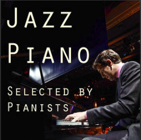
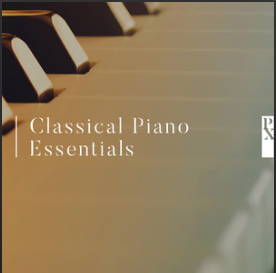

```{r}
library(tidyverse)
library(plotly)
library(spotifyr)
source('spotify.R')
```

### Introduction and Corpus

**Introduction**

One of the biggest differences between jazz and classical music is that when you playing jazz, you have to improvise and compose on the spot and range things, however, with classical music, you are playing all the notes composed. A study even proved that there is a different process occurred in the brains of the jazz and classical pianists. In particular, the jazz pianists' brains began re-planning sooner than the classical pianists' brains. Classical pianists tend to focus on the 'how'. This means their focus is on technique and the personal expression they add to the piece. Jazz pianists on the other hand focus on the ‘what’ to play, meaning they are always prepared to improvise and adapt the notes they're playing. 

The output melody under 2 contrary mindses are different. Thus,this storyboard is going to analyzing the difference between jazz and classical music trying to illustrate what is the major difference between such freestyle and disciplined music.

**Corpus**

To completed the research focusing on the piano songs of both music genres, 2 Spotify playlist will be taken. 

| Playlist | Name | Discription | Number of tracks |
| :-: | :-: | - |:-: |
|  | [Jazz Piano seleted by Jazz Pianoists](URL 'https://open.spotify.com/user/jasonluxmusic/playlist/621IKNkRFQQkauQygKcrPC?si=IrbnsHjhRuiDFekHGD9pbg')  | Jazz piano pieces selected by pianists. Solo acoustic piano only; no rhythm or vocals.| 65 |
| | [Classical Piano Essentials](URL'https://open.spotify.com/user/doublejmusic/playlist/5ifMsPihlkYEGCakqfqj17?si=kPoYH712REKzdDsE6Dxf_A') | The world's greatest piano songs, featuring Fur Elise, Clair De Lune, River flows in you etc.) | 135 |
  
 
  M_dan M_ener M_loud M_spee M_live M_val M_tem M_inst M_acous
  <dbl>  <dbl>  <dbl>  <dbl>  <dbl> <dbl> <dbl>  <dbl>   <dbl>
1 0.423  0.127  -20.6 0.0544  0.162 0.179  96.9  0.887   0.981  Jazz  
  
  
    M_dan M_ener M_loud M_spee M_live M_val M_tem M_inst M_acous
  <dbl>  <dbl>  <dbl>  <dbl>  <dbl> <dbl> <dbl>  <dbl>   <dbl>
1 0.376 0.0609  -27.0 0.0562  0.103 0.226  93.0  0.895   0.991  classical

***

### Comparison and Analysis

```{r}

#Jazz
Jazz <- get_playlist_audio_features('jasonluxmusic', '621IKNkRFQQkauQygKcrPC')


#Classical
Classical <- get_playlist_audio_features('doublejmusic', '5ifMsPihlkYEGCakqfqj17')


#Data
Dataset <-
  Jazz %>% mutate(genre = "Jazz") %>%
  bind_rows(Classical %>% mutate(genre = "Classical"))

#Image
  LMVE <- Dataset %>%                       # Start with awards.
  ggplot(                         # Set up the plot.
    aes(
      x = loudness,
      y = valence,
      size = energy,
      colour = mode
    )
  ) +
  geom_point() +               # Scatter plot.
  geom_smooth(col="white") +
  geom_rug(size = 0.001) +       # Add 'fringes' to show data distribution.
  facet_wrap(~ genre) +     # Separate charts per playlist.
  scale_x_continuous(          # Fine-tune the x axis.
    limits = c(-45, -8),
    breaks = c(-45, 4, -8),  # Use grid-lines for quadrants only.
    minor_breaks = NULL      # Remove 'minor' grid-lines.
  ) +
  scale_y_continuous(          # Fine-tune the y axis in the same way.
    limits = c(0, 0.9),
    breaks = c(0, 0.1, 0.9),
    minor_breaks = NULL
  ) +
  scale_colour_brewer(         # Use the Color Brewer to choose a palette.
    type = "qual",           # Qualitative set.
    palette = "Paired"       # Name of the palette is 'Paired'.
  ) +
  scale_size_continuous(       # Fine-tune the sizes of each point.
    trans = "exp",           # Use an exp transformation to emphasise loud.
    guide = "none"           # Remove the legend for size.
  ) +
  theme_light() +              # Use a simpler them.
  labs(                        # Make the titles nice.
    x = "loudness",
    y = "valence",
    size = "energy",
    colour = "Mode"
  )
ggplotly(LMVE)
```
***
Just changed topic
To be continue.
