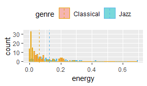
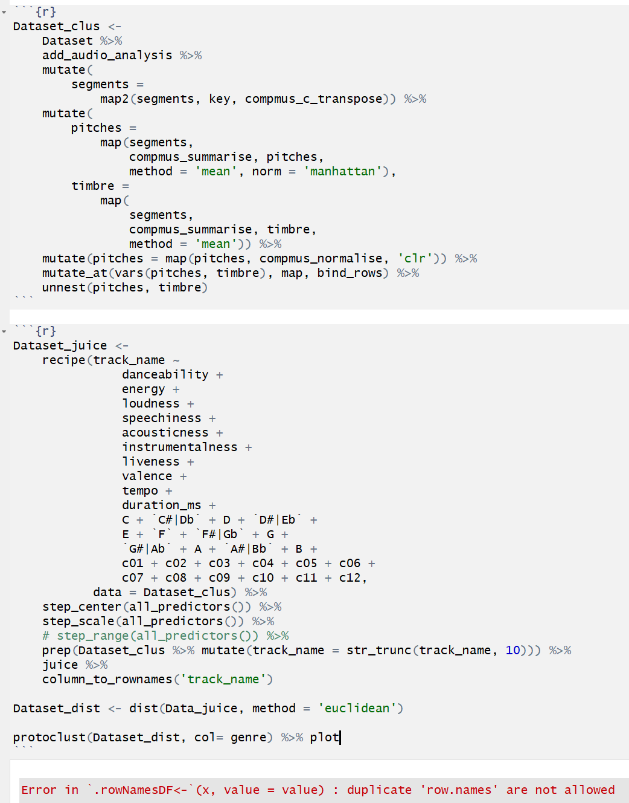
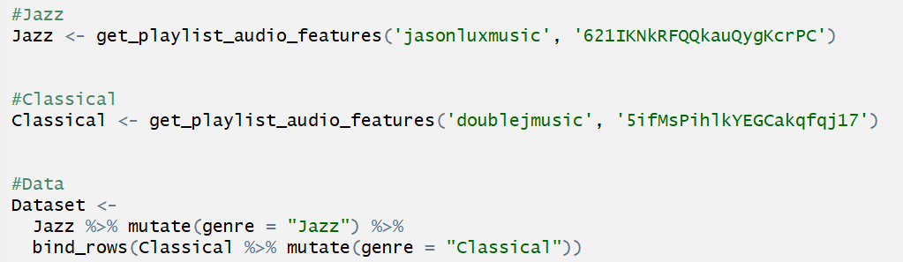

```{r}
library(tidyverse)
library(tidymodels)
library(ggdendro)
library(protoclust)
library(heatmaply)
library(spotifyr)
library(compmus)
source('spotify.R')
```

### Introduction and Corpus

**Introduction**

One of the biggest differences between jazz and classical music is that when you playing jazz, you have to improvise and compose on the spot and range things, however, with classical music, you are playing all the notes composed. A study even proved that there is a different process occurred in the brains of the jazz and classical pianists. In particular, the jazz pianists' brains began re-planning sooner than the classical pianists' brains. Classical pianists tend to focus on the 'how'. This means their focus is on technique and the personal expression they add to the piece. Jazz pianists on the other hand focus on the ‘what’ to play, meaning they are always prepared to improvise and adapt the notes they're playing. 

The output melody under 2 contrary mindses are different. Thus,this storyboard is going to analyzing the difference between jazz and classical music trying to illustrate what is the major difference between such freestyle and disciplined music by graphs.

**Corpus**

To completed the research focusing on the piano songs of both music genres, 2 Spotify playlist will be taken. 

| Playlist | Name | Discription | Number of tracks |
| :-: | :-: | - |:-: |
| | [Jazz Piano seleted by Jazz Pianoists](URL 'https://open.spotify.com/user/jasonluxmusic/playlist/621IKNkRFQQkauQygKcrPC?si=IrbnsHjhRuiDFekHGD9pbg')  | Jazz piano pieces selected by pianists. Solo acoustic piano only; no rhythm or vocals.| 65 |
| | [Classical Piano Essentials](URL'https://open.spotify.com/user/doublejmusic/playlist/5ifMsPihlkYEGCakqfqj17?si=kPoYH712REKzdDsE6Dxf_A') | The world's greatest piano songs, featuring Fur Elise, Clair De Lune, River flows in you etc.) | 135 |

Spotify API have 12 features for a track, namely, key, mode, time_signature, acousticness, danceability, energy, instrumentalness, liveness, loudness, speechiness, valence, tempo. To see explanation for each variable, please click "[Here](URL'https://developer.spotify.com/documentation/web-api/reference/tracks/get-audio-features/)"

### 4 major track differences between 2 list {data-commentary-width=500}

```{r}

#Jazz
Jazz <- get_playlist_audio_features('jasonluxmusic', '621IKNkRFQQkauQygKcrPC')


#Classical
Classical <- get_playlist_audio_features('doublejmusic', '5ifMsPihlkYEGCakqfqj17')


#Data
Dataset <-
  Jazz %>% mutate(genre = "Jazz") %>%
  bind_rows(Classical %>% mutate(genre = "Classical"))

#Image
  LMVE <- Dataset %>%                       # Start with awards.
  ggplot(                         # Set up the plot.
    aes(
      x = loudness,
      y = valence,
      size = energy,
      colour = mode
    )
  ) +
  geom_point(alpha = 0.8) +               # Scatter plot.
  geom_rug(size = 0.001) +       # Add 'fringes' to show data distribution.
  facet_wrap(~ genre) +     # Separate charts per playlist.
  scale_x_continuous(          # Fine-tune the x axis.
    limits = c(-45, -8),
    breaks = c(-45, 5, -8),  # Use grid-lines for quadrants only.
    minor_breaks = NULL      # Remove 'minor' grid-lines.
  ) +
  scale_y_continuous(          # Fine-tune the y axis in the same way.
    limits = c(0, 0.9),
    breaks = c(0, 0.2, 0.9),
    minor_breaks = NULL
  ) +
  scale_color_manual(values=c("#E69F00", "#56B4E9")) +
  scale_size_continuous(       # Fine-tune the sizes of each point.
    trans = "exp",           # Use an exp transformation to emphasise loud.
    guide = "none"           # Remove the legend for size.
  ) +
  theme_light() +              # Use a simpler them.
  labs(                        # Make the titles nice.
    x = "loudness",
    y = "valence",
    size = "energy",
    colour = "Mode"
  )
ggplotly(LMVE)

```

***

*fail to add a label -- to be fixed.*


This graph shows the four most different dimensions of jazz and classical music. The *x* axis shows 'loudness' and the *y* axis shows Spotify’s 'valence’ feature.  The major mode is in <font color=#E69F00>orange</font>  whereas the minor mode is in <font color=#56B4E9>blue</font>. The size of each dot represents the energy of each track.

In jazz tracks, the proportion of **majors** ( *88%* ) is relatively larger than the proportion of major in Classical music list (*63%*). The **loudness** is mainly distributed from -26 to -13 in jazz list, but this range is lager in Classical music list where it is distributed from -36 to -15 with a higher standard deviation judging by the more scattered dots. The feature of **valence** does not seems so different except the highest and lowest valence tracks in the Classical list. According to the dots size and the figures in Figure 2, Classical music is peaceful on average whereas jazz music is evenly distributed across different energy.

All in all, the visualisation shows that Jazz music is (according to Spotify) rather louder and rather energetic than the Claasical music.


**Figure 1.** A summary of the mean of each variable.

| Genre | M_danancibility | ***M_enerergy*** | ***M_loudness*** | M_speechiness | M_liveness | ***M_valence*** | M_tempo | M_instrumentalness | M_acousticness |
| :-: |:-:|:-:|:-:|:-:|:-:|:-:|:-:|:-:|:-:|
| Jazz| 0.423 | *0.127* | *-20.6* | 0.0544  | 0.162 | *0.179* | 96.9  | 0.887 |  0.981  | 
| Classialc| 0.376 | *0.0609*  | *-27.0* | 0.0562 |  0.103 | *0.226* |  93.0 | 0.895 | 0.991 |


**Figure 2.** Energy distrybution (Vertical dotted line represents the average value of each genre.)




### Chromagrams features

```{r}
First_love <- 
  get_tidy_audio_analysis('47ZWr1Nb0PUgmKgyg5JkgO') %>% 
  select(segments) %>% unnest(segments) %>% 
  select(start, duration, pitches)

First_love %>% 
  mutate(pitches = map(pitches, compmus_normalise, 'euclidean')) %>% 
  compmus_gather_chroma %>% 
  ggplot(
    aes(
      x = start + duration / 2, 
      width = duration, 
      y = pitch_class, 
      fill = value)) + 
  geom_tile() +
  labs(x = 'Time (s)', y = NULL, fill = 'Magnitude') +
  theme_minimal() +
  ggtitle("River Flows in You by Yiruma")

Peace_Piece <- 
  get_tidy_audio_analysis('58yFroDNbzHpYzvicaC0de') %>% 
  select(segments) %>% unnest(segments) %>% 
  select(start, duration, pitches)

Peace_Piece %>% 
  mutate(pitches = map(pitches, compmus_normalise, 'euclidean')) %>% 
  compmus_gather_chroma %>% 
  ggplot(
    aes(
      x = start + duration / 2, 
      width = duration, 
      y = pitch_class, 
      fill = value)) + 
  geom_tile() +
  labs(x = 'Time (s)', y = NULL, fill = 'Magnitude') +
  theme_minimal() +
  ggtitle("Peace Piece by Bill Evans") 

```

***

First love by Yiruma and Peace piece by Bill Evans are the most popular songs in 2 list. Chromatograms show the capture 12 pitch classes for each song while the music is playing.
One interesting fact is that Peace piece from Jazz list prefer playing G a lot in the key of C major with relatively gentle harmony showed by the lighter blue in other pitch classes, but Yiruma seems to be fair to the three major keys when playing a song in A major.


###  Self-Similarity Matrices - Peace piece by Bill Evans

```{r}
Peace_self <- 
    get_tidy_audio_analysis('58yFroDNbzHpYzvicaC0de') %>% 
    compmus_align(bars, segments) %>% 
    select(bars) %>% unnest(bars) %>% 
    mutate(
        pitches = 
            map(segments, 
                compmus_summarise, pitches, 
                method = 'acentre', norm = 'manhattan')) %>% 
    mutate(
        timbre = 
            map(segments, 
                compmus_summarise, timbre, 
                method = 'mean'))
Peace_pic <- 
    bind_rows(
        Peace_self %>% compmus_self_similarity(pitches, 'aitchison') %>% mutate(d = d / max(d), type = "Chroma"),
        Peace_self %>% compmus_self_similarity(timbre, 'euclidean') %>% mutate(d = d / max(d), type = "Timbre")) %>% 
    ggplot(
        aes(
            x = xstart + xduration / 2, 
            width = xduration,
            y = ystart + yduration / 2,
            height = yduration,
            fill = d)) + 
    geom_tile() +
    coord_fixed() +
    facet_wrap(~ type) +
    scale_fill_viridis_c(option = 'E', guide = 'none') +
    theme_classic() +
    labs(x = '', y = '') +
    ggtitle("Peace Piece by Bill Evans") 
ggplotly(Peace_pic)


```

***

*Illustrating pitch- and timbre-based self-similarity of the most popular track in the Jazz play list called Peace piece by Bill Evans* 


### Self-Similarity Matrices - First love by Yiruma

```{r}
First_self <- 
    get_tidy_audio_analysis('47ZWr1Nb0PUgmKgyg5JkgO') %>% 
    compmus_align(bars, segments) %>% 
    select(bars) %>% unnest(bars) %>% 
    mutate(
        pitches = 
            map(segments, 
                compmus_summarise, pitches, 
                method = 'acentre', norm = 'manhattan')) %>% 
    mutate(
        timbre = 
            map(segments, 
                compmus_summarise, timbre, 
                method = 'mean'))
First_pic <- 
    bind_rows(
        First_self %>% compmus_self_similarity(pitches, 'aitchison') %>% mutate(d = d / max(d), type = "Chroma"),
        First_self %>% compmus_self_similarity(timbre, 'euclidean') %>% mutate(d = d / max(d), type = "Timbre")) %>% 
    ggplot(
        aes(
            x = xstart + xduration / 2, 
            width = xduration,
            y = ystart + yduration / 2,
            height = yduration,
            fill = d)) + 
    geom_tile() +
    coord_fixed() +
    facet_wrap(~ type) +
    scale_fill_viridis_c(option = 'E', guide = 'none') +
    theme_classic() +
    labs(x = '', y = '')  +
  ggtitle("River Flows in You by Yiruma")
ggplotly(First_pic)

```

***

*Illustrating pitch- and timbre-based self-similarity of the most popular track in the Classic play list called First love by Yiruma* 

Self-similarity matrics graphically depict the similarity between two-time regions in 2 audio files. One audio file is represented as a square. Each side of the square is proportional to the length of the piece, and time runs from left to right as well as from bottom to top. Similar regions are dark  while dissimilar regions are  the novelty which is illustrated by the yellow line. Thus there is always a dark diagonal line running from bottom left to top right because the audio is always the most similar to itself at any particular time.
The Chroma and timbre grams do not show a huge difference is because both tracks are played only by piano. However, the music structure between 2 songs differs. 

For the track peace by piece, the song suddenly changes after 2 mins and have another new section after 5 mins. By contrast, River flows in you seems to be more structured, reflecting by the regularsequential squares and yellow lines.


### Keygram - Peace piece by Bill Evans

```{r}
circshift <- function(v, n) {if (n == 0) v else c(tail(v, n), head(v, -n))}
                                    
    # C     C#    D     Eb    E     F     F#    G     Ab    A     Bb    B 
major_chord <- 
    c(1,    0,    0,    0,    1,    0,    0,    1,    0,    0,    0,    0)
minor_chord <- 
    c(1,    0,    0,    1,    0,    0,    0,    1,    0,    0,    0,    0)
seventh_chord <- 
    c(1,    0,    0,    0,    1,    0,    0,    1,    0,    0,    1,    0)

major_key <- 
    c(6.35, 2.23, 3.48, 2.33, 4.38, 4.09, 2.52, 5.19, 2.39, 3.66, 2.29, 2.88)
minor_key <-
    c(6.33, 2.68, 3.52, 5.38, 2.60, 3.53, 2.54, 4.75, 3.98, 2.69, 3.34, 3.17)

chord_templates <-
    tribble(
        ~name  , ~template,
        'Gb:7'  , circshift(seventh_chord,  6),
        'Gb:maj', circshift(major_chord,    6),
        'Bb:min', circshift(minor_chord,   10),
        'Db:maj', circshift(major_chord,    1),
        'F:min' , circshift(minor_chord,    5),
        'Ab:7'  , circshift(seventh_chord,  8),
        'Ab:maj', circshift(major_chord,    8),
        'C:min' , circshift(minor_chord,    0),
        'Eb:7'  , circshift(seventh_chord,  3),
        'Eb:maj', circshift(major_chord,    3),
        'G:min' , circshift(minor_chord,    7),
        'Bb:7'  , circshift(seventh_chord, 10),
        'Bb:maj', circshift(major_chord,   10),
        'D:min' , circshift(minor_chord,    2),
        'F:7'   , circshift(seventh_chord,  5),
        'F:maj' , circshift(major_chord,    5),
        'A:min' , circshift(minor_chord,    9),
        'C:7'   , circshift(seventh_chord,  0),
        'C:maj' , circshift(major_chord,    0),
        'E:min' , circshift(minor_chord,    4),
        'G:7'   , circshift(seventh_chord,  7),
        'G:maj' , circshift(major_chord,    7),
        'B:min' , circshift(minor_chord,   11),
        'D:7'   , circshift(seventh_chord,  2),
        'D:maj' , circshift(major_chord,    2),
        'F#:min', circshift(minor_chord,    6),
        'A:7'   , circshift(seventh_chord,  9),
        'A:maj' , circshift(major_chord,    9),
        'C#:min', circshift(minor_chord,    1),
        'E:7'   , circshift(seventh_chord,  4),
        'E:maj' , circshift(major_chord,    4),
        'G#:min', circshift(minor_chord,    8),
        'B:7'   , circshift(seventh_chord, 11),
        'B:maj' , circshift(major_chord,   11),
        'D#:min', circshift(minor_chord,    3),
)

key_templates <-
    tribble(
        ~name    , ~template,
        'Gb:maj', circshift(major_key,  6),
        'Bb:min', circshift(minor_key, 10),
        'Db:maj', circshift(major_key,  1),
        'F:min' , circshift(minor_key,  5),
        'Ab:maj', circshift(major_key,  8),
        'C:min' , circshift(minor_key,  0),
        'Eb:maj', circshift(major_key,  3),
        'G:min' , circshift(minor_key,  7),
        'Bb:maj', circshift(major_key, 10),
        'D:min' , circshift(minor_key,  2),
        'F:maj' , circshift(major_key,  5),
        'A:min' , circshift(minor_key,  9),
        'C:maj' , circshift(major_key,  0),
        'E:min' , circshift(minor_key,  4),
        'G:maj' , circshift(major_key,  7),
        'B:min' , circshift(minor_key, 11),
        'D:maj' , circshift(major_key,  2),
        'F#:min', circshift(minor_key,  6),
        'A:maj' , circshift(major_key,  9),
        'C#:min', circshift(minor_key,  1),
        'E:maj' , circshift(major_key,  4),
        'G#:min', circshift(minor_key,  8),
        'B:maj' , circshift(major_key, 11),
        'D#:min', circshift(minor_key,  3))


Peace_Key <- 
    get_tidy_audio_analysis('58yFroDNbzHpYzvicaC0de') %>% 
    compmus_align(sections, segments) %>% 
    select(sections) %>% unnest(sections) %>% 
    mutate(
        pitches = 
            map(segments, 
                compmus_summarise, pitches, 
                method = 'acentre', norm = 'manhattan')) %>% 
    compmus_match_pitch_template(key_templates, 'aitchison', 'manhattan') %>% 
    ggplot(
        aes(x = start + duration / 2, width = duration, y = name, fill = d)) +
    geom_tile() +
    scale_fill_viridis_c(option = 'E') +
    theme_minimal() +
    labs(x = 'Time (s)', y = '', fill = 'Distance') +
    ggtitle("Peace Piece by Bill Evans") 
ggplotly(Peace_Key)
```

***

explanation
the graph does not show....


### Keygram - First love by Yiruma

```{r}
First_Key <- 
    get_tidy_audio_analysis('47ZWr1Nb0PUgmKgyg5JkgO') %>% 
    compmus_align(sections, segments) %>% 
    select(sections) %>% unnest(sections) %>% 
    mutate(
        pitches = 
            map(segments, 
                compmus_summarise, pitches, 
                method = 'acentre', norm = 'manhattan')) %>% 
    compmus_match_pitch_template(key_templates, 'aitchison', 'manhattan') %>% 
    ggplot(
        aes(x = start + duration / 2, width = duration, y = name, fill = d)) +
    geom_tile() +
    scale_fill_viridis_c(option = 'E') +
    theme_minimal() +
    labs(x = 'Time (s)', y = '', fill = 'Distance') +
    ggtitle("River Flows in You by Yiruma")
ggplotly(First_pic)
```

***

explanation

***

### Classification Algorithms

```{r}
Jazz_120<- get_playlist_audio_features('jasonluxmusic', '621IKNkRFQQkauQygKcrPC') %>% 
    slice(1:40) %>% 
    add_audio_analysis
Classical_120 <- get_playlist_audio_features('doublejmusic', '5ifMsPihlkYEGCakqfqj17') %>% 
    slice(1:40) %>% 
    add_audio_analysis

indie <- 
    Jazz_120 %>% mutate(playlist = "Jazz") %>% 
    bind_rows(
        Classical_120 %>% mutate(playlist = "Classical")) %>% 
    mutate(playlist = factor(playlist)) %>% 
    mutate(
        segments = 
            map2(segments, key, compmus_c_transpose)) %>% 
    mutate(
        pitches = 
            map(segments, 
                compmus_summarise, pitches, 
                method = 'mean', norm = 'manhattan'),
        timbre =
            map(
                segments,
                compmus_summarise, timbre,
                method = 'mean')) %>% 
    mutate(pitches = map(pitches, compmus_normalise, 'clr')) %>% 
    mutate_at(vars(pitches, timbre), map, bind_rows) %>% 
    unnest(pitches, timbre)

indie_class <- 
    recipe(playlist ~
               danceability +
               energy +
               loudness +
               speechiness +
               acousticness +
               instrumentalness +
               liveness +
               valence +
               tempo +
               duration_ms +
               C + `C#|Db` + D + `D#|Eb` +
               E + `F` + `F#|Gb` + G +
               `G#|Ab` + A + `A#|Bb` + B +
               c01 + c02 + c03 + c04 + c05 + c06 +
               c07 + c08 + c09 + c10 + c11 + c12,
           data = indie) %>% 
    step_center(all_predictors()) %>%
    step_scale(all_predictors()) %>%
    # step_range(all_predictors()) %>% 
    prep(indie) %>% 
    juice

indie_cv <- indie_class %>% vfold_cv(5)

indie_knn <- nearest_neighbor(neighbors = 1) %>% set_engine('kknn')
predict_knn <- function(split)
    fit(indie_knn, playlist ~ ., data = analysis(split)) %>% 
    predict(assessment(split), type = 'class') %>%
    bind_cols(assessment(split))

indie_cv %>% 
    mutate(pred = map(splits, predict_knn)) %>% unnest(pred) %>% 
    conf_mat(truth = playlist, estimate = .pred_class)

indie_cv %>% 
    mutate(pred = map(splits, predict_knn)) %>% unnest(pred) %>% 
    conf_mat(truth = playlist, estimate = .pred_class) %>% 
    autoplot(type = 'heatmap')
```

### Hierarchical Clustering

Error: 


The way I compute my "dataset":



Dataset_clus <- 
    Dataset %>% 
    add_audio_analysis %>% 
    mutate(
        segments = 
            map2(segments, key, compmus_c_transpose)) %>% 
    mutate(
        pitches = 
            map(segments, 
                compmus_summarise, pitches, 
                method = 'mean', norm = 'manhattan'),
        timbre =
            map(
                segments,
                compmus_summarise, timbre,
                method = 'mean')) %>% 
    mutate(pitches = map(pitches, compmus_normalise, 'clr')) %>% 
    mutate_at(vars(pitches, timbre), map, bind_rows) %>% 
    unnest(pitches, timbre)


Dataset_juice <- 
    recipe(track_name ~
               danceability +
               energy +
               loudness +
               speechiness +
               acousticness +
               instrumentalness +
               liveness +
               valence +
               tempo +
               duration_ms +
               C + `C#|Db` + D + `D#|Eb` +
               E + `F` + `F#|Gb` + G +
               `G#|Ab` + A + `A#|Bb` + B +
               c01 + c02 + c03 + c04 + c05 + c06 +
               c07 + c08 + c09 + c10 + c11 + c12,
           data = Dataset_clus) %>% 
    step_center(all_predictors()) %>%
    step_scale(all_predictors()) %>%
    # step_range(all_predictors()) %>% 
    prep(Dataset_clus %>% mutate(track_name = str_trunc(track_name, 10))) %>% 
    juice %>%
    column_to_rownames('track_name')

Dataset_dist <- dist(Data_juice, method = 'euclidean')

protoclust(Dataset_dist, col= genre) %>% plot

